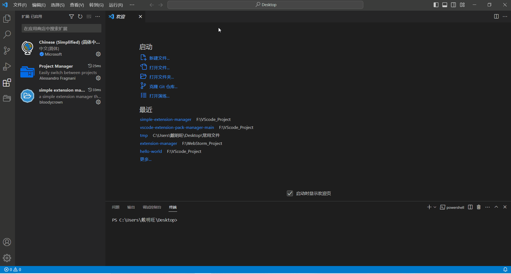

# Simple Extension Manager

[简体中文](README.zh-cn.md)

Due to the fact that [hayden-fr](https://github.com/hayden-fr)/[vscode-extension-pack-manager](https://github.com/hayden-fr/vscode-extension-pack-manager)
has not been maintained for a long time and I am not very good at React, I borrowed his ideas and used Vue to rewrite this plugin.

Its function is still to simply create extension packs, then organize extensions and batch prohibit extensions through extension packs.

## The following commands can be used

- `extension packs:manage`  - Create custom extension packs
- `extension pack:view`     - Show custom expansion packs

## Features include:

- Create personalized extension packs for bulk extension management (install, uninstall, disable, etc)
- Easily update name, description and display icon for your packs
- Create nested packs (packs within packs) for bulk install / uninstall
- Portability. Packs are synchronized with VSCode settings <!-- Please confirm that I am correct with this -->

### Preview

